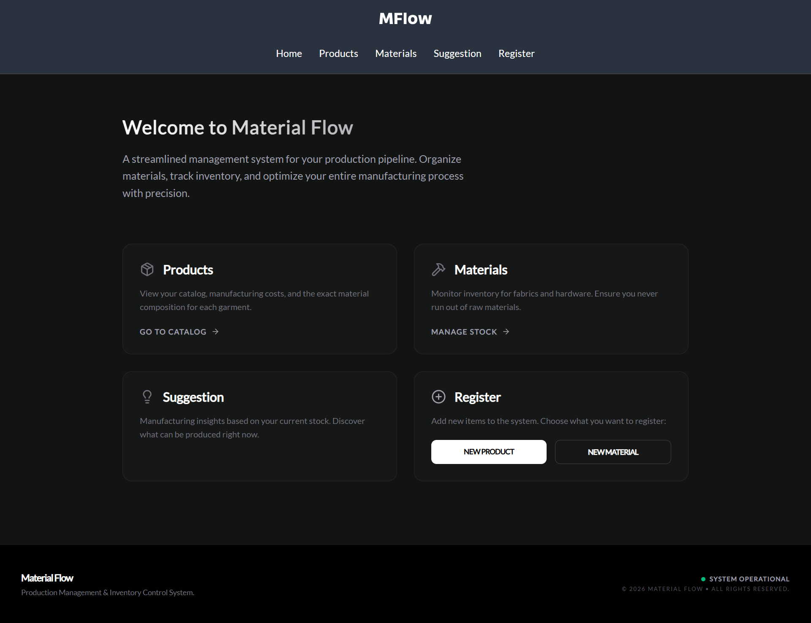
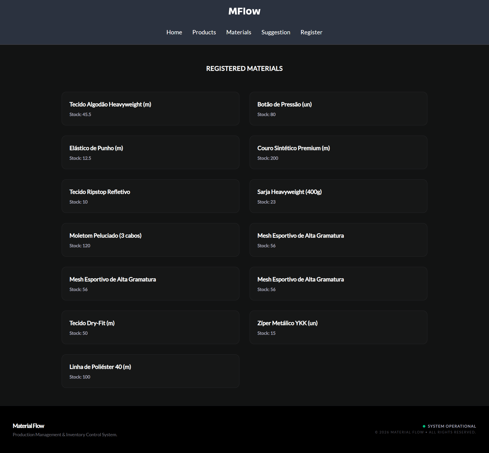

# Material Flow - Resource Planning


> **Material Flow** é um sistema inteligente de gestão de recursos e planejamento de produção. O projeto resolve o problema de "o que posso produzir hoje?" cruzando a composição técnica dos produtos com o estoque real de insumos.

---

## Índice

- [Sobre](#sobre)
- [Preview](#preview)
- [Tecnologias Utilizadas](#tecnologias-utilizadas)
- [Funcionalidades](#funcionalidades)
- [Objetivos de Aprendizagem](#objetivos-de-aprendizagem)
- [Arquitetura do Projeto](#arquitetura-do-projeto)
- [Links do Projeto](#links-do-projeto)
- [Como Executar](#como-executar)
- [Licença](#licença)

---

## Sobre

### O Projeto

**Material Flow** é uma aplicação Fullstack desenvolvida para otimizar o chão de fábrica de pequenas e médias confecções.

O sistema gerencia **Materiais** e **Produtos**. Seu diferencial é um algoritmo que analisa a composição técnica de cada item e calcula, em tempo real, a produção máxima possível com base no estoque disponível.

Diferente de projetos anteriores focados apenas em SPA (Single Page Applications), este projeto explora o poder do **Next.js** para renderização híbrida e otimizada.

---

## Preview



&nbsp;



---

## Tecnologias Utilizadas

### Frontend (Client)

- **Framework:** Next.js 14+ (App Router)
- **Estilização:** TailwindCSS & Shadcn/UI
- **Formulários:** React Hook Form & Zod
- **Estado Global:** Zustand
- **Fontes:** Next/Font (Google Fonts)
- **Feedback:** Sonner

### Backend (API)

- **Runtime:** Node.js & Express
- **Linguagem:** TypeScript
- **Banco de Dados:** PostgreSQL (via Neon)
- **ORM:** Prisma
- **Arquitetura:** Clean Architecture (SOLID)

---

## Objetivos de Aprendizagem

Este projeto foi construído especificamente para migrar meus conhecimentos de React "puro" (Vite) para o ecossistema **Next.js**, aplicando conceitos modernos de renderização e formulários. Os principais focos de estudo foram:

- **App Router:** Abandono do `react-router-dom` em favor do roteamento baseado em sistema de arquivos do Next.js, compreendendo a hierarquia de `layouts.tsx`, `pages.tsx` e tratamento de rotas dinâmicas.
- **Server Components & Use Client:** Entendimento prático da diferença entre renderização no servidor (padrão) e no cliente. Aprendi a isolar a interatividade (botões, hooks) em ilhas de componentes (`"use client"`) mantendo o restante da página estática e performática.
- **Server Actions:** Implementação de mutações de dados diretamente no servidor. Ao invés de criar rotas de API intermédias no front, utilizei Actions para comunicar o Frontend diretamente com os serviços, simplificando o fluxo de dados.
- **React Hook Form:** Gerenciamento avançado de formulários. Diferente de estados manuais (`useState`), utilizei essa lib para lidar com validações complexas e arrays dinâmicos de campos (ex: adicionar múltiplos materiais a um produto) com performance otimizada.
- **Metadata API:** Configuração de SEO dinâmico, definindo `title` e `description` específicos para cada rota de forma programática.
- **Inglês Técnico:** Prática de escrita em inglês para documentação de código, commits e comentários, simulando um ambiente de desenvolvimento internacional e padronizado.
- **Fontes Otimizadas:** Uso do `next/font` para carregar fontes do Google sem _Layout Shift_ (CLS), melhorando a métrica de performance do site.

---

## Funcionalidades

- **Gestão de Estoque:** CRUD completo de materiais com feedback visual de status.
- **Engenharia de Produto:** Cadastro de produtos com composição dinâmica (Receita do produto).
- **Algoritmo de Gargalo:** Cálculo automático de disponibilidade de produção baseado no item mais escasso do estoque.
- **Interface Otimizada:** Modais acessíveis, toasts de feedback e carregamento com Skeletons via Suspense.

## Arquitetura do Projeto

A estrutura reflete a organização do **App Router**:

```bash
material-flow/
├── backend/                  # API Clean Architecture
│   └── src/
│       ├── useCases/         # Regras de Negócio (Sugestão de Prod.)
│       └── repositories/     # Acesso ao Prisma/DB
│
└── frontend/                 # Next.js App
    ├── app/                  # App Router
    │   ├── materials/        # Rota de Materiais
    │   ├── products/         # Rota de Produtos
    │   ├── layout.tsx        # Layout Raiz (Fontes + Header)
    │   └── page.tsx          # Home
    ├── components/           # Componentes "Use Client" e Server
    ├── services/             # Server Actions (Chamadas API)
    ├── stores/               # Zustand (Estado Global UI)
    └── validations/          # Schemas Zod (Compartilhados)
```

---

## Como Executar

### Pré-requisitos

- Node.js (v18+)

### Passo 1: Backend

1.  Acesse a pasta do servidor:
    ```bash
    cd backend
    npm install
    ```
2.  Configure o `.env` com seu banco PostgreSQL e rode:
    ```bash
    npx prisma migrate dev
    npm run dev
    ```

### Passo 2: Frontend

1.  Acesse a pasta do web:
    ```bash
    cd frontend
    npm install
    ```
2.  Inicie o servidor de desenvolvimento Next.js:
    ```bash
    npm run dev
    ```
3.  Acesse **http://localhost:3000**.

---

## Links do Projeto

- **Aplicação (Vercel):** [https://material-flow-xi.vercel.app/](https://material-flow-xi.vercel.app/)
- **API (Render):** [https://material-flow.onrender.com](https://material-flow.onrender.com)

> **⚠️ Nota:** A API está hospedada em serviço gratuito (Render), podendo haver um _cold start_ de até 50 segundos na primeira requisição.

---

## Licença

Este projeto está licenciado sob a Licença MIT - veja o arquivo [LICENSE](LICENSE) para mais detalhes.
